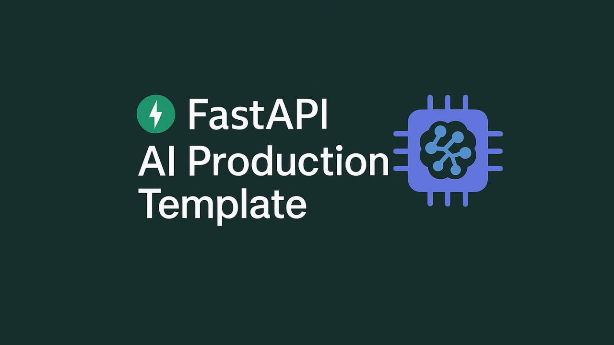

<h1 align="center">Fastapi AI Production Boilerplate</h1>

<h3 align="center">Simple starter repo for your Machine Learning/AI projects</h3>
<p align="center">
    
</p>

<p align="center">
    
    <a href="https://github.com/wahyudesu/Fastapi-AI-Production-Template/commits/main">
        
    </a>
    <a href="https://github.com/wahyudesu/Fastapi-AI-Production-Template/blob/main/pyproject.toml">
        
    </a>
    <!-- <a href="https://github.com/wahyudesu/Fastapi-AI-Production-Template/blob/main/LICENSE">
        
    </a> -->
    <a href="https://sonarcloud.io/summary/new_code?id=wahyudesu_Fastapi-AI-Production-Template">
        
    </a>
    <!-- <a href="https://github.com/wahyudesu/Fastapi-AI-Production-Template">
        
    </a> -->
    <a href="https://github.com/wahyudesu">
        
    </a>
</p>

<p align="center">
    
    
    
    
    
</p>
<p align="center">
<a href="https://www.producthunt.com/products/github-144?embed=true&utm_source=badge-featured&utm_medium=badge&utm_source=badge-github&#0045;ff853e12&#0045;a865&#0045;4ab6&#0045;8424&#0045;133c242178f1" target="_blank"></a>
</p>


## Use Case
- Build and serve machine learning models via production-ready APIs
- Create scalable and easily deployable AI/ML backend services
- Develop AI Agent applications based on FastAPI
- Support end-to-end model experimentation, serving, and deployment

## Features
- ✅Built in Security and API endpoint protection
- ✅Lightweight Dockerfile with best practices
- ✅Router serving support for ML, AI models and AI agents
- ✅Project dependencies, env using uv
- ✅Simple Logging using loguru
- ✅Kubernetes manifests: Deployment, Service, HPA, Ingress
- ✅Ready for production and educational use
- ✅Lint and formatting using ruff
- ✅Jupyter notebook for experiment ml and building ai agent
- ✅Rate limiter and Middleware
- ✅Very well documentation for easy understanding
- ... Adding MCP Features

## Project Structure

```
root-project/
├── app/
│   ├── main.py                # FastAPI entrypoint
│   ├── logger.py              # Logging 
│   ├── middleware.py          # Middleware logging and rate limiter
│   ├── model/                 # Model artifacts (e.g., pickle files)
│   └── routers/               # API routers (chatbot, predict, etc.)
│       ├── agent.py           # Agent research endpoints
│       ├── chatbot.py         # Chatbot endpoints (file upload, entity extraction, etc.)
│       └── predict.py         # Prediction endpoints (ML, summarization, etc.)
├── data/                      # Dataset
├── k8s/                       # Kubernetes
└── notebook/                  # Jupyter notebooks for experiments
```

This structure makes code management and feature development easier.

- For LLM, use notebooks such as `notebooks/langgraph.ipynb` for experiments.
- For ML, use notebooks like `notebook/bayesian-regression.ipynb`, the `data` folder for datasets, and the `model` folder for models and training/prediction code.

- Model serving and API endpoints are organized in the `app/routers` folder.

> For more details, see the [FastAPI Documentation](https://fastapi.tiangolo.com/).

## Installation & Setup

Make sure you have [`uv` installed](https://docs.astral.sh/uv/getting-started/installation/) .

```powershell
# Clone repository
git clone https://github.com/wahyudesu/fastapi-ai-template

cd fastapi-ai-template

# Development
uv venv
.venv\Scripts\activate

uv sync

# Copy and edit .env file
cp .env.example .env
# Edit .env according to your needs
# Edit token for security and groq api key if u use llm
```

Linter
```
uv run ruff check
```

## Run on local
```powershell
uv run uvicorn app.main:app --reload
```

After running the command above, your FastAPI application will be available at [http://localhost:8000](http://localhost:8000?token=token).  

You can access the beautiful interactive API documentation at [http://localhost:8000/scalar](http://localhost:8000/scalar).

You can also access the interactive API documentation on default swagger-ui at [http://localhost:8000/docs](http://localhost:8000/docs).

To access the MCP endpoint, go to [http://localhost:8000/mcp](http://localhost:8000/mcp).

## Docker
Build the Docker image with:

```powershell
docker build -t fastapi-app .
```
Run the Docker container locally with:


```powershell
docker run -p 8000:80 fastapi-app
```

## Deployment 

<p align="center">
    
    
    
    
</p>

You can use virtually any cloud provider to deploy your FastAPI application. Before deploying, make sure you understand the basic concepts.

You can read more about deployment concepts [here](https://fastapi.tiangolo.com/deployment/concepts) .


> This project is developed for modern LLMOps/ML pipelines and is ready for deployment on both cloud platforms and VPS.

## 🤝 Contributing

1. Fork this repository;
2. Create your branch: `git checkout -b my-new-feature`;
3. Commit your changes: `git commit -m 'Add some feature'`;
4. Push to the branch: `git push origin my-new-feature`.
5. After your pull request is merged, you can safely delete your branch.

## ⏭️ What's Next?
Saya membuat repo ini se-minimal dan se-sederhana mungkin, dengan fitur yang cukup lengkap, agar memudahkan pemula dalam mengembangkan project melalui repo ini.
Jika repo ini dirasa bermanfaat bisa bintangin dan share ke teman yang membutuhkan, jika cukup ramai saya ada rencana untuk membuat versi lanjutannya yang lebih advanced, dengan fitur tambahan seperti JWT security, ORM, Grafana, dan ML integration. Yang bakal fokus spesifik ke ML dan LLMOps

## FAQ

<details>
    <summary><strong>Why FastAPI?</strong></summary>
    <ul>
        <li>FastAPI is a modern, high-performance web framework for building APIs with Python. For AI apps, it serves as the interface between your AI models and the outside world, allowing external systems to send data to your models and receive predictions or processing results. What makes FastAPI particularly appealing is its simplicity and elegance—it provides everything you need without unnecessary complexity.</li>
    </ul>
</details>

<details>
    <summary><strong>What is Uvicorn?</strong></summary>
    <ul>
        <li>Uvicorn is a lightning-fast ASGI server implementation for Python, commonly used to run FastAPI applications in production. It enables asynchronous request handling and is well-suited for modern web frameworks.</li>
    </ul>
</details>

<details>
    <summary><strong>Is this boilerplate connected to a database?</strong></summary>
    <ul>
        <li>You can add a database such as PostgreSQL, MySQL, or SQLite depending on your use case. If you are only serving models, a database may not be necessary. This repository is designed to be as simple as possible so users can get started quickly.</li>
    </ul>
</details>

<details>
    <summary><strong>How about security?</strong></summary>
    <ul>
        <li>The project includes built-in security features such as API endpoint protection, authentication, and rate limiting. You can further enhance security by configuring environment variables and using HTTPS in production.</li>
    </ul>
</details>

<details>
    <summary><strong>What can I develop with this?</strong></summary>
    <ul>
        <li>It depends on your project use case. For serving AI or ML models, this boilerplate is more than sufficient. If you need more features, you can add observability and monitoring tools such as Opik, Comet, or MLflow.</li>
    </ul>
</details>
