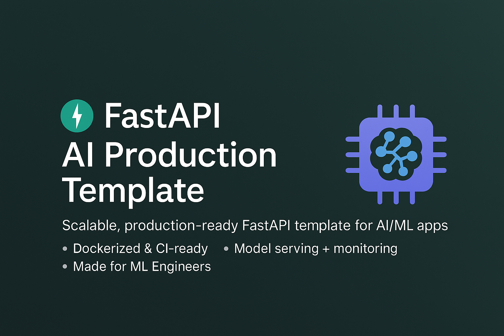

<h1 align="center">Fastapi AI Production Template</h1>

<h3 align="center">Simple starter template for your Machine Learning/AI projects</h3>

<p align="center">
    
</p>
<p align="center">
    <a href="">
        
    </a>
    <a href="">
        
    </a>
    <a href="">
        
    </a>
    <a href="">
        
    </a>
    <a href="https://github.com/wahyudesu">
        
    </a>
</p>

<p align="center">
    
    
    
    
    
    
</p>

## Use Case
- Build and serve machine learning models via production-ready APIs
- Create scalable and easily deployable AI/ML backend services
- Develop AI Agent applications based on FastAPI
- Integrate LLM workflows, monitoring, and prompt management
- Support end-to-end model experimentation, deployment, and monitoring

## Features
- [`FastAPI`](https://fastapi.tiangolo.com/) for API and backend
- [`LangChain`](https://www.langchain.com/) for LLM integration and AI workflows
- [`Groq`](https://groq.com/) for fast LLM inference and model provider
- [`uv`](https://docs.astral.sh/uv/) for Python environment management
- [`Docker`](https://www.docker.com/) for containerization
- [`PostgreSQL`](https://www.postgresql.org/) for database
- [`Ruff`](https://docs.astral.sh/ruff/) for Python linting and formatting
- [`Opik`](https://www.comet.com/site/products/opik/) for ai agent and prompt management monitoring

## Project structure

```
root-project/
├── app/
│   ├── main.py                # FastAPI app entrypoint
│   ├── dependencies.py        # Dependency injection (token, etc)
│   ├── internal/              # Internal/private routers (e.g. admin)
│   ├── routers/               # API routers (LLM, feedback, chatbot, etc)
│   │   ├── chatbot.py         # Chatbot endpoints (file upload, entity extraction, plagiarism, etc)
│   │   ├── example.py         # Example endpoints (LLM workflow, feedback, etc)
│   │   └── predict.py         # Prediction endpoints (ML Predict, summarization, relevance, etc)
│   └── model/                 # Model artifacts (pickle)
├── notebook/                  # Jupyter notebooks for experiments
├── public/                    # File static (image, documents, etc)
├── pyproject.toml             # Python dependencies & project config
├── uv.lock                    # Lockfile for uv/poetry
└── README.md                  # Project documentation
```

## Installation & Setup

Make sure you have [`uv` installed](https://docs.astral.sh/uv/getting-started/installation/) .

```powershell
# Clone repository
git clone https://github.com/wahyudesu/fastapi-ai-template
cd fastapi-ai-template

# Install Python:
uv python install 3.12.8

# Development
uv venv
.venv\Scripts\activate
uv sync

# Copy and edit .env file
cp .env.example .env
# Edit .env according to your needs

# Build & start all services (FastAPI, Airflow, MLflow, monitoring, etc.)
docker compose up --build -d

# Check service status
docker compose ps
```

## Testing

```powershell
uv run pytest
```

## Deployment GCP

1. Deploy VM (Ubuntu) di GCP Compute Engine
2. Install Docker & Docker Compose di VM
3. Clone repo & copy `.env` ke VM
4. Jalankan:
   ```bash
   docker compose up --build -d
   ```
5. (Opsional) Setup Nginx reverse proxy & SSL untuk domain


> Project ini dikembangkan untuk workflow LLMOps/ML pipeline modern, siap untuk deployment di cloud maupun VPS.


## 🤝 Contributing

1. Fork this repository;
2. Create your branch: `git checkout -b my-new-feature`;
3. Commit your changes: `git commit -m 'Add some feature'`;
4. Push to the branch: `git push origin my-new-feature`.
5. After your pull request is merged, you can safely delete your branch.


## FAQ

<details>
    <summary><strong>Apakah ini gratis?</strong></summary>
    <ul>
        <li>Ya, gratis untuk penggunaan secara personal dan non-komersial.</li>
    </ul>
</details>

<details>
    <summary><strong>Apakah ini open-source?</strong></summary>
    <ul>
        <li>Ya, open-source dibawah lisensi MIT.</li>
    </ul>
</details>
